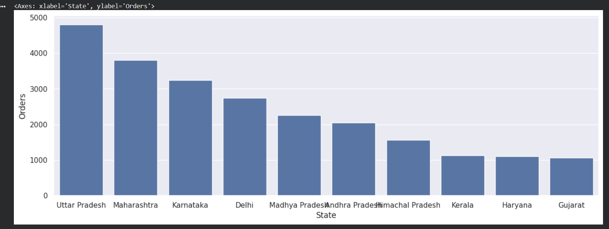
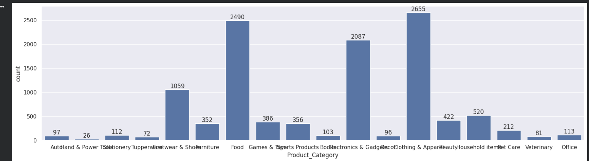
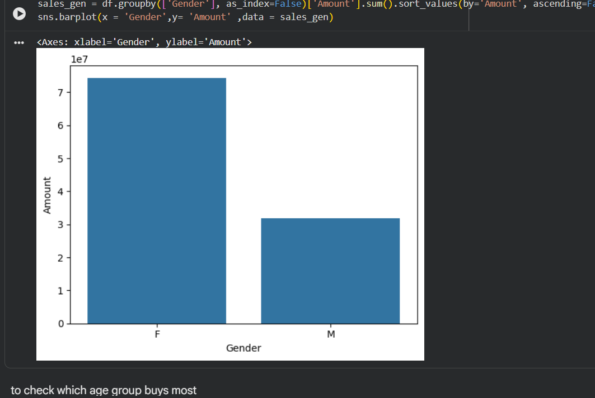
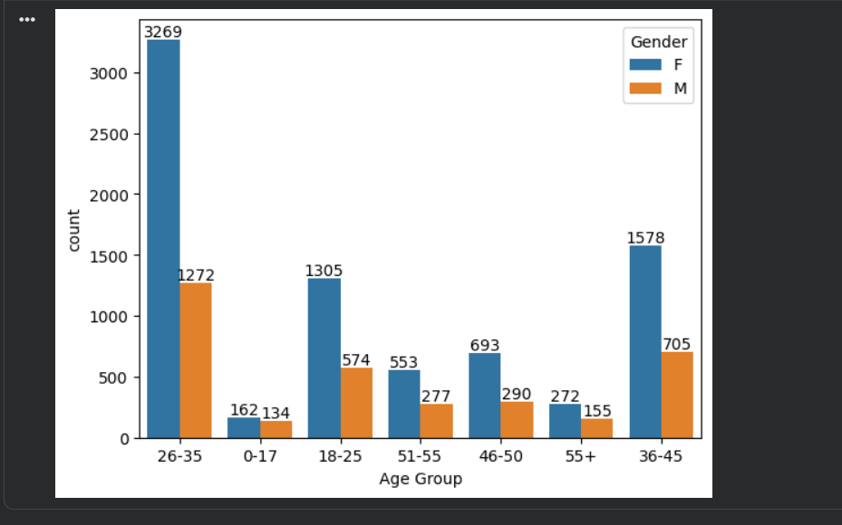

# 🪔 Diwali Sales Analysis

## 📌 Project Overview
This project performs **Exploratory Data Analysis (EDA)** on a Diwali sales dataset to understand customer purchasing behavior, identify high-performing segments, and generate business insights.

The analysis focuses on customer demographics, product categories, and regional performance.

---

## 🛠️ Tools & Technologies Used
- Python
- Pandas
- NumPy
- Matplotlib
- Seaborn
- Google Colab

---

## 📊 Dataset Description
The dataset includes:
- Gender
- Age Group
- State
- Product Category
- Orders
- Amount (Sales)

---

## 📊 Analysis & Insights

### 🌍 State-wise Orders Analysis

This visualization shows the number of orders from different states.

**Insights:**
- **Uttar Pradesh** has the highest number of orders.
- Followed by **Maharashtra** and **Karnataka**.
- Indicates strong customer base in these regions.
- Businesses should focus marketing and logistics in top-performing states.

---

### 🛍️ Product Category Analysis

This chart represents the count of purchases across different product categories.

**Insights:**
- **Clothing & Apparel** has the highest number of purchases.
- Followed by **Food** and **Electronics & Gadgets**.
- Categories like **Auto** and **Hand & Power Tools** have very low demand.
- Helps businesses prioritize inventory and promotions.

---

### 👩 Gender vs Sales Amount

This visualization shows total sales contribution based on gender.

**Insights:**
- Female customers contribute significantly more to total sales.
- Indicates higher purchasing power or engagement among female buyers.
- Marketing campaigns can be tailored towards female audiences.

---

### 🧑‍🤝‍🧑 Age Group & Gender Analysis

This chart shows purchase distribution across different age groups and gender.

**Insights:**
- Age group **26–35** has the highest number of buyers.
- Females dominate across almost all age groups.
- Young adults are the most active buyers during Diwali.
- Targeting this segment can maximize revenue.

---

## 💼 Business Insights
- Target audience: **Females aged 26–35**
- High-performing states: **Uttar Pradesh, Maharashtra, Karnataka**
- Top product categories: **Clothing, Food, Electronics**
- Sales strategy should focus on **demographics + region + category**

---

## 🚀 Conclusion
This analysis highlights key trends in customer behavior during Diwali sales.  
Businesses can use these insights to:
- Improve targeted marketing
- Optimize product offerings
- Focus on high-performing regions

---

## 🙌 Author
**Harsh Thakur**
